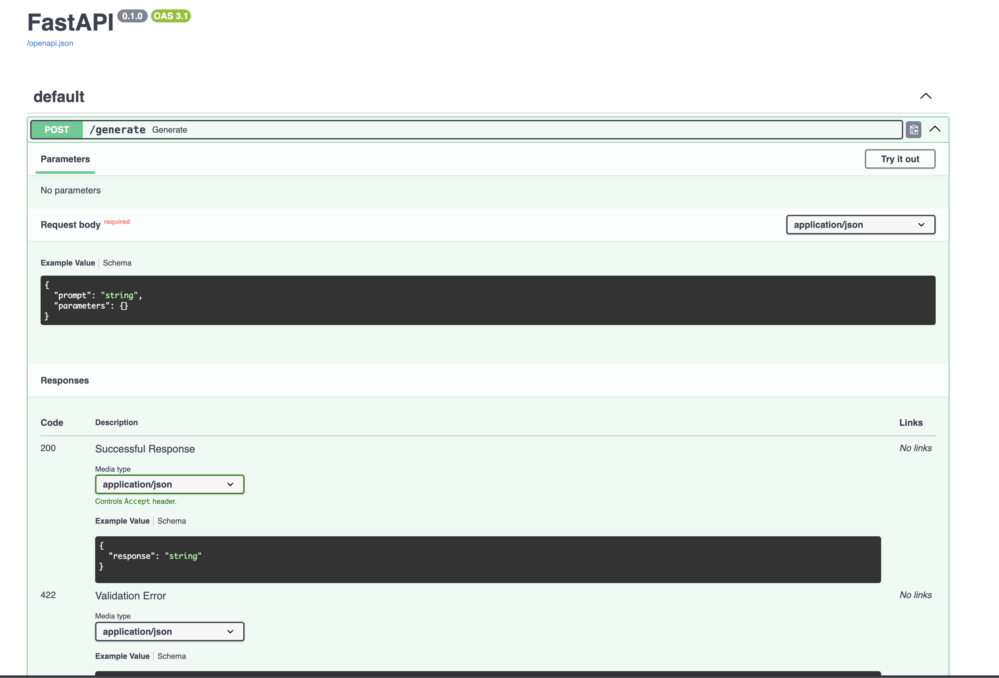
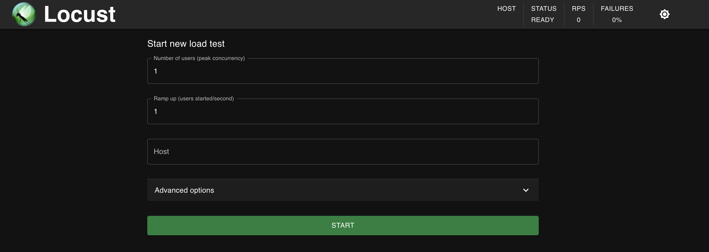
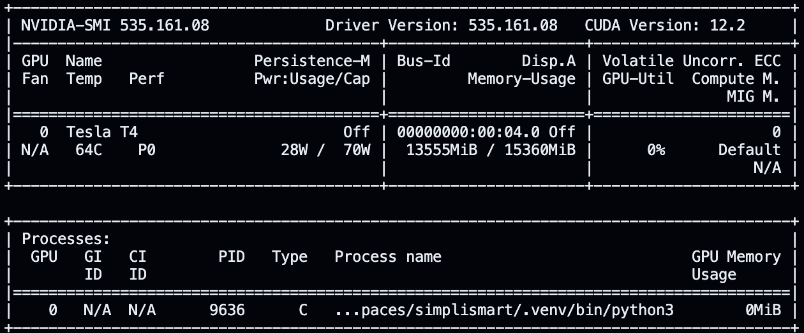
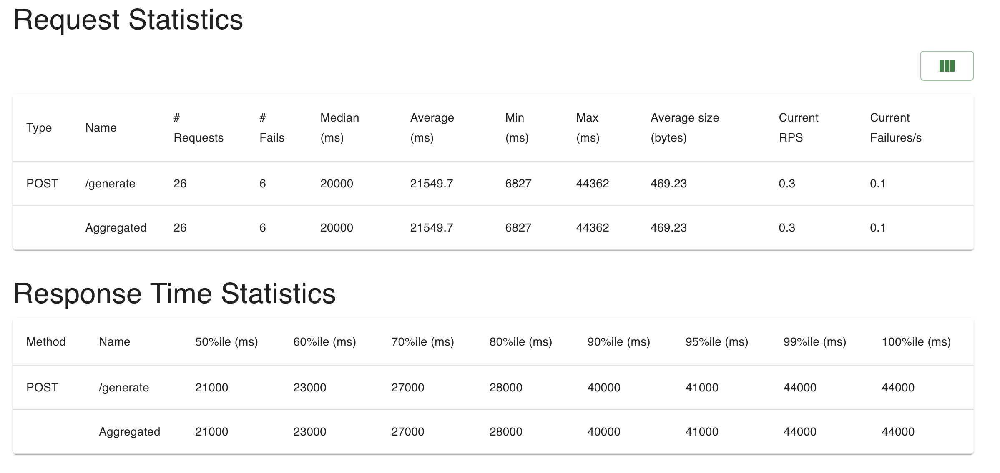
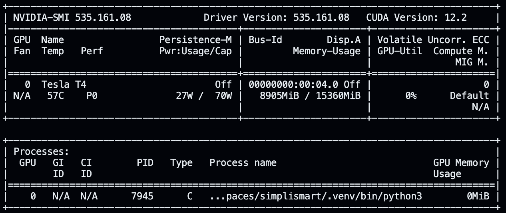
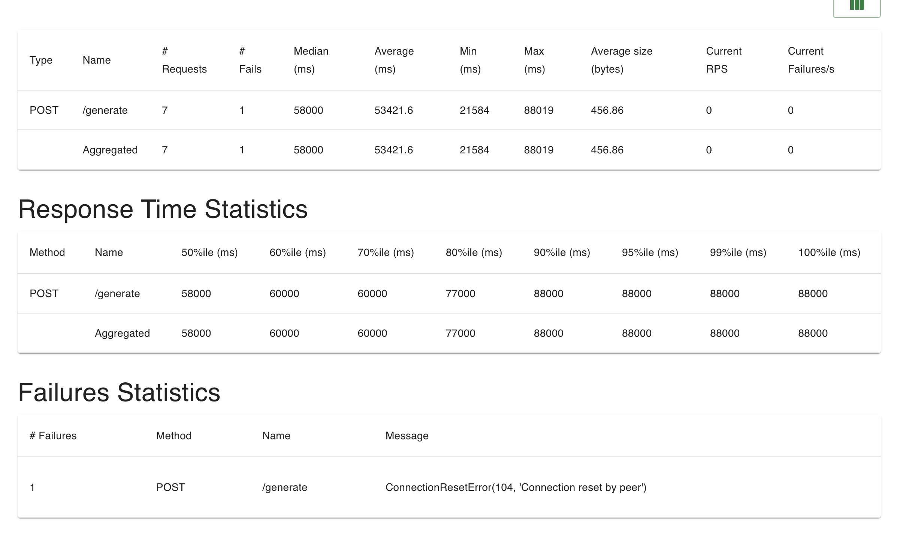

# Simplismart Interview Assignment

## Setup

- python3 -m venv .venv
- source .venv/bin/activate
- pip install medusa-llm transformers locust fastapi uvicorn 
- pip install -U bitsandbytes #Will come in play later

## Start the inference server

- uvicorn main:app

## Testing

You can check the fastAPI doc on http://0.0.0.0:8000/docs .

For the purpose of testing scalability and performance, I'm just going to use a simple generate function. 

Once the fastAIP app is running, check the endpoint with 

```python
import requests
url = "http://0.0.0.0:8000/generate"

# Define the payload
payload = {
    "prompt": "Tell me something about hip hop.",
    "parameters": {
        "temperature": 0.5,
        "max_steps": 100,
    },
}

# Send the POST request
response = requests.post(url, json=payload)

# Print the response
print(response.json().get("response"))
```

## Scalability and Performance

For this I'll be using locust to do a load test to see how many users I can handle concurrently and what does the latency look like as the number of users increases. 

To start locust test:

- locust -f locustfile.py

The UI will look something like below



## Analysis

This test was run on a T4 machine which was accessible to me.

The model I chose to run this on was FasterDecoding/medusa-vicuna-7b-v1.3.

Medusa is an interesting way to achieve faster inference times but its biggest limitation is that is only supports a batch size of 1 right out of the box. Supporting more requests for multiple heads requires heavy modification of the Medusa Library which I believe has diminishing returns. 

I ran the load test with the following params

- number of peak users  = 5
- ramp up of user 0.1/s (1 new user in 10 seconds)
- run the test for 150 seconds to sustain peak for 100 seconds
- number of input tokens = 7
- number of output tokens = 100

The results

### After loading in half precision
Memory Usage




22 requests were completed with 6 failures. The effective RPS was 0.3.

The p50 Latency for the requests was 23 seconds.
The p90 Latency for the requests was 40 seconds.
### After loading in 8 bits

Memory Usage looks like this




Only 7 requests were finished successfully in time which brings the effective RPS close to 0.0 .

The p50 latency for the requests was 58 seconds.
The p90 latency for the requests was 88 seconds.


Here we can see that loading the model in 8 bits did not improve the performance in any way.

## Conclusion

On a single T4, this is very limited and poor performance. This is due to the hardware limitation of the Nvidia Tesla T4 GPU.

Usually it would be the case where quantization or loading the model in lower bits would inprove the performance, but in this test it did not. The main reason for that is that even though we had enough memory to generate tokens, having multiple heads just increased the load on the GPU. 